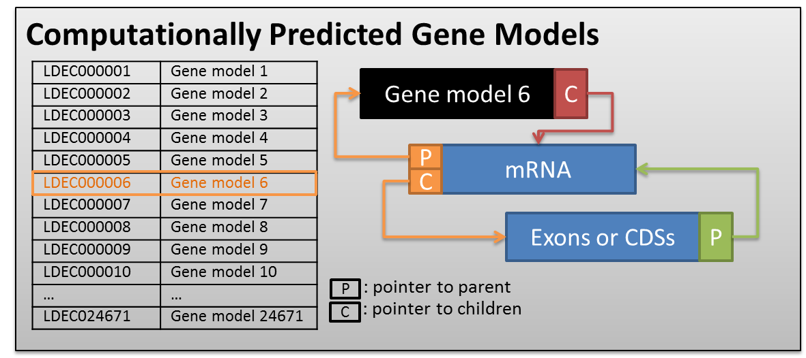
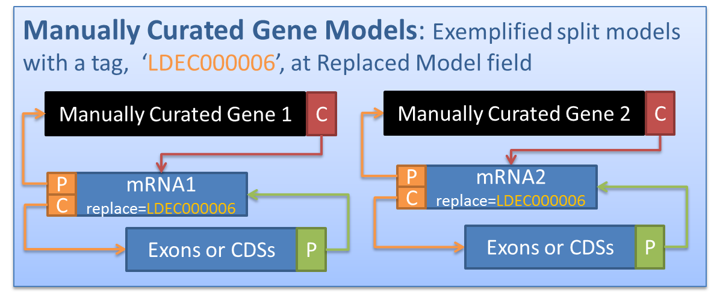
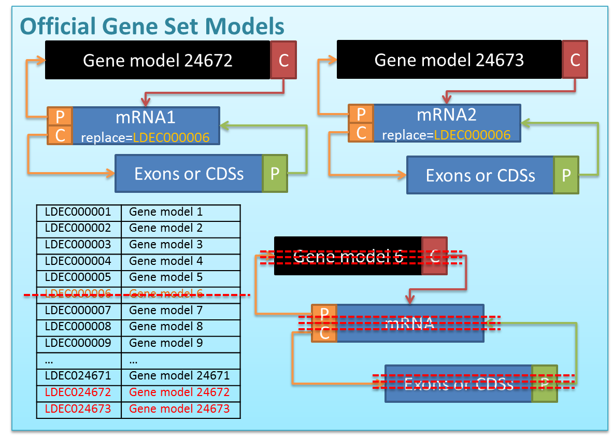

# gff3_merge full documentation

## Table of Contents  

[Background](#background)

[Replace Tags](#replace-tags)

[Automatically assigning replace tags](#automatically-assigning-replace-tags)

[Rules for adding a replace tag on your own](#rules-for-adding-a-replace-tag-on-your-own)

[Replacing and adding models with  multiple isoforms](#replacing-and-adding-models-with-multiple-isoforms)

[Odd use cases](#odd-use-cases)

[How the merge works](#how-the-merge-works)

## Background

The program gff3_merge.py was developed to merge output from the manual annotation program Apollo (http://genomearchitect.github.io/) with a single reference GFF3 file as part of the i5k pilot project. The idea is to have a program that will take manual annotations from Apollo, and fold these into a single reference gene set, where manual annotations replace overlapping models in the reference gene set.

At a minimum, we recommend running the program gff3_QC.py on the manual annotation GFF3 prior to running gff3_merge.py, if not also the reference GFF3 file. Otherwise, you may incorporate errors into the merged GFF3 file, or the merge program may not work to begin with.

The program gff3_merge.py can be conceptually separated into 3 steps:

1. Recognize or auto-assign [Replace Tags](#replace-tags) to transcripts or mRNAs in the modified GFF3 file
2. Determine merge actions based on the Replace Tags:
  - deletion – a model has the status ‘Delete’
  - simple replacement – a model has a single replace tag
  - new addition – a model has a replace tag ‘NA’
  - split replacement – a modified model shares a replace tag with other modified models
  - merge replacement – a model has multiple replace tags

3. Models from modified GFF3 file replace models from reference GFF3 file based on merge actions in step 2.

Note that all information, including functional information (e.g. Name, Dbxrefs, etc.), from the modified GFF3 file replaces the corresponding reference information in the merged GFF3 file, meaning that any functional information in models slated to be replaced in the reference GFF3 file will NOT be carried over into the merged GFF3 file.

View the [gff3_merge.py readme](https://github.com/NAL-i5K/GFF3toolkit/blob/master/gff3_merge.md) for instructions on how to run the program.

## Replace Tags 
([back](#table-of-contents))

The replace tag is a custom GFF3 attribute in the new or modified GFF3 file that specifies which mRNA(s) or transcript(s) from a single reference GFF3 file should be replaced by the new annotation. The replace tag follows this format: replace=[Name or ID attribute of reference mRNA or transcript to be replaced]. The replace tag could be added through Apollo program (check the tutorial [here](https://i5k.nal.usda.gov/apollo-replaced-models-field-explanations-and-examples)), or directly added into the new or modified GFF3 file.

Here's an example:

An updated model slated to replace the reference model, XM_015654027.1:

```
LGIB01000001.1  .       gene    404667  404856  .       -       .      ID=test.gene.1
LGIB01000001.1  .       mRNA    404667  404856  .       -       .       replace=XM_015654027.1;Name=Improved annotation;Parent=test.gene.1;ID=test.mRNA.1
LGIB01000001.1  .       exon    404667  404856  .       -       .       Parent=ID=test.mRNA.1;
LGIB01000001.1  .       CDS     404667  404856  .       -       0       Parent=ID=test.mRNA.1;
```

The reference model to be replaced:

```
LGIB01000001.1  Gnomon  gene    359394  404856  .       -       .       ID=gene28;
LGIB01000001.1  Gnomon  mRNA    359394  404856  .       -       .       ID=rna33;Parent=gene28;Name=XM_015654027.1;
LGIB01000001.1  Gnomon  exon    404667  404856  .       -       .       ID=id260;Parent=rna33;
LGIB01000001.1  Gnomon  exon    362164  362815  .       -       .       ID=id261;Parent=rna33;
LGIB01000001.1  Gnomon  exon    359394  359920  .       -       .       ID=id262;Parent=rna33;
LGIB01000001.1  Gnomon  CDS     404667  404856  .       -       0       ID=cds33;Parent=rna33;
LGIB01000001.1  Gnomon  CDS     362164  362815  .       -       2       ID=cds33;Parent=rna33;
LGIB01000001.1  Gnomon  CDS     359515  359920  .       -       1       ID=cds33;Parent=rna33;
```

### Automatically assigning replace tags
([back](#table-of-contents))

You can choose to have the program auto-assign [replace tags](#replace-tags) for you. (This is the default behavior.) **The auto-assignment program ONLY works for mRNA features.** For all other feature types, if there is no replace tag, the program will add 'replace=NA'.  The program will identify which mRNA models from the modified GFF3 file overlap in coding sequence with models from the reference GFF3 file. The program will add a 'replace' attribute with the IDs of overlapping models. Specifically, the program will do the following:
- Extract CDS and pre-mRNA sequences from mRNA features from both GFF3 files.
- Use blastn to determine which sequences from the modified and reference GFF3 file align to each other **in their coding sequence**. These parameters are used: `-evalue 1e-10 -penalty -15 -ungapped`
- If two models pass the alignment step, the program will add a 'replace' attribute with the ID of each overlapping model to the modified gff3 file.
- If no reference model overlaps with a new model, then the program will add 'replace=NA'.
- If one model overlaps another in an intron or UTR (but not within the coding sequence), the auto-assignment program will NOT assign a replace tag. This is because it's not always clear whether the overlapping model should be replaced. You will receive a warning message that this model does not have a replace tag and therefore was not incorporated into the merged gff3 file. You can then go back and manually add a replace tag to the original gff3 file. 

### Rules for adding a replace tag on your own
([back](#table-of-contents))

- **If you are replacing non-coding features, and/or replacing coding features with non-coding features, then you must manually include a [replace tag](#replace-tags) for these replacement actions.**
- **Replacing a model**: Use the Name or ID attribute of the mRNA or transcript to be replaced. (Don't use the ID or Name of the gene, exon, CDS, or other child features). `replace=CLEC00001-RA`
- **Adding a new model**: Use 'NA' as the replace tag value. `replace=NA`
- **Deleting a reference model**: Use the 'status' attribute with value 'delete' to indicate whether a model from the original gff3 should be deleted. The model that carries the status attribute will NOT be used in the merged gff3. `status=delete`
- **Merging a reference model**: If multiple reference models need to be merged into one, then the modified, merged model should carry replace tags with IDs or Names of all models to be merged. `replace=CLEC00001-RA,CLEC00002-RA`
- **Splitting a reference model**: If a reference model needs to be split, you will need to add a replace tag with the model ID or Name of the split reference model to BOTH models in the modified GFF3. E.g. split model 1: `replace=CLEC00001-RA`, split model 2: `replace=CLEC00001-RA`
- The merge program will check your replace tags, and will throw an error if your replace tag does not meet these assumptions. You will need to update your replace tags according to the error message, and run the program again after fixing.
- If you are using the Apollo manual annotation program at the i5k Workspace to generate the modified GFF3 file, there will be a 'Replaced Models' field in the information editor where you should enter the replace tag information. See https://i5k.nal.usda.gov/apollo-replaced-models-field-explanations-and-examples.

## Replacing and adding models with multiple isoforms
([back](#table-of-contents))

Although the merge program assigns and expects replace tags at the mRNA/transcript level, it essentially behaves as if it should replace models at the gene level. This is not noticeable if both the reference and modified model are single-isoform - however, it may cause confusion with multi-isoform reference models, or if a new isoform should be added. The program assumes that the modified model(s) should have replace tags for ALL isoforms of the gene model to be replaced.

**Replacing a multi-isoform model**: If a modified model overlaps with a multi-isoform model, the current behavior is to replace ALL isoforms, not single isoforms. The auto-assignment program will assign replace tags corresponding to all overlapping isoforms. The portion of the program that checks the replace tags assumes this behavior. If you added replace tags yourself, and a modified model does not contain replace tags for ALL isoforms of the gene model to be replaced, the program will throw an error, and you will need to add these replace tags for the program to complete.

**Adding a new isoform**: If you are adding a new isoform to an existing model, you MUST include all reference isoforms that you would like included in the merged GFF3 file to the modified GFF3 file.

**Example**, one isoform replacing two isoforms. The merged GFF3 file will contain only the single isoform in the modified GFF3 file. The modified GFF3 file contains replace tags for both isoforms of the reference model to be replaced.

Reference GFF3:
```
LGIB01000001.1  Gnomon  gene    1267752 1268637 .       -       .       ID=gene96;
LGIB01000001.1  Gnomon  mRNA    1267752 1268637 .       -       .       ID=rna96;Parent=gene96
LGIB01000001.1  Gnomon  exon    1268346 1268637 .       -       .       Parent=rna96
LGIB01000001.1  Gnomon  exon    1267752 1268263 .       -       .       Parent=rna96
LGIB01000001.1  Gnomon  CDS     1268346 1268637 .       -       0       Parent=rna96
LGIB01000001.1  Gnomon  CDS     1267818 1268263 .       -       2       Parent=rna96

LGIB01000001.1  Gnomon  gene    1267818 1268637 .       -       .       ID=gene100
LGIB01000001.1  Gnomon  mRNA    1267818 1268637 .       -       .       ID=rna100;Parent=gene100
LGIB01000001.1  Gnomon  exon    1267818 1268263 .       -       .       Parent=rna100
LGIB01000001.1  Gnomon  exon    1268346 1268637 .       -       .       Parent=rna100
LGIB01000001.1  Gnomon  CDS     1267818 1268263 .       -       2       Parent=rna100
LGIB01000001.1  Gnomon  CDS     1268346 1268637 .       -       0       Parent=rna100
```
Modified GFF3:
```
LGIB01000001.1  .       gene    1267752 1268263 .       -       .       ID=geneID1;
LGIB01000001.1  .       mRNA    1267752 1268263 .       -       .       Parent=geneID1;ID=mrnaID1;replace=rna96,rna100
LGIB01000001.1  .       exon    1267752 1268263 .       -       .       Parent=mrnaID1;
LGIB01000001.1  .       CDS     1267818 1268261 .       -       0       Parent=mrnaID1;
```
**Example**, adding a new isoform. The merged GFF3 file will contain all information from the modified GFF3 file. The modified GFF3 file contains both isoforms, even though one of the isoforms has identical coordinates to the reference isoform. Both mRNAs in the modified GFF3 file contain the same replace tags, because they both replace the reference model rna96.

Reference GFF3:
```
LGIB01000001.1  Gnomon  gene    1267752 1268637 .       -       .       ID=gene96;
LGIB01000001.1  Gnomon  mRNA    1267752 1268637 .       -       .       ID=rna96;Parent=gene96
LGIB01000001.1  Gnomon  exon    1268346 1268637 .       -       .       Parent=rna96
LGIB01000001.1  Gnomon  exon    1267752 1268263 .       -       .       Parent=rna96
LGIB01000001.1  Gnomon  CDS     1268346 1268637 .       -       0       Parent=rna96
LGIB01000001.1  Gnomon  CDS     1267818 1268263 .       -       2       Parent=rna96
```
Modified GFF3:
```
LGIB01000001.1  .       gene    1267752 1268637 .       -       .       ID=geneID1
LGIB01000001.1  .       mRNA    1267752 1268263 .       -       .       Parent=geneID1;ID=mRNAID1;replace=rna96
LGIB01000001.1  .       exon    1267752 1268263 .       -       .       Parent=mRNAID1
LGIB01000001.1  .       CDS     1267818 1268261 .       -       0       Parent=mRNAID1
LGIB01000001.1  .       mRNA    1267752 1268637 .       -       .       Parent=geneID1;ID=mRNAID2;replace=rna96
LGIB01000001.1  .       exon    1268346 1268637 .       -       .       Parent=mRNAID2
LGIB01000001.1  .       CDS     1268346 1268637 .       -       0       Parent=mRNAID2
LGIB01000001.1  .       CDS     1267818 1268263 .       -       2       Parent=mRNAID2
LGIB01000001.1  .       exon    1267752 1268263 .       -       .       Parent=mRNAID2
```

## Odd use cases 
([back](#table-of-contents))

- If you are replacing non-coding features, and/or replacing coding features with non-coding features, then you must manually include a replace tag for these replacement actions.
- It is possible for a modified model to have multiple isoforms that do not share CDS with each other - for example with partial models due to a poor genome assembly. In this case, the auto-assignment program will assign different replace tags to each isoform, but will then reject these auto-assigned replace tags because it expects isoforms of a gene model to have the same replace tags (see section "[Some notes on multi-isoform models](#replacing-and-adding-models-with-multiple-isoforms)", above). You'll need to add the replace tags manually - all isoforms should carry the replace tags of all models to be replaced by the whole gene model.
- If one model overlaps another in an intron or UTR (but not within the coding sequence), the auto-assignment program will NOT assign a replace tag. This is because it's not always clear whether the overlapping model should be replaced. You will receive a warning message that this model does not have a replace tag and therefore was not incorporated into the merged gff3 file. You can then go back and manually add a replace tag to the original gff3 file. 
- Note that gff3_merge will NOT replace the ID attributes for existing features in your gff3 files. Therefore, if a new feature is added into the merged file that has an identical ID with an existing feature, then there will be duplicate IDs for this feature in the merged gff3 file.  

## How the merge works 
([back](#table-of-contents))

In this pipeline, a GFF3 file is parsed into a structure composed of simple python dict and list. Within a list, every gene model uses a tree structure to store the relationships between parents and children. The figure below showed an example (LDEC000006) how it works on the gff file of computationally predicted gene models. 


The same structure is also applied on the gff file of manually curated gene models, but one more attribute, 'replace=', is added and required for manually curated gene models. This mandatory ‘Replaced Models’ field specifies which gene models from the computationally predicted gene set should be replaced by the manually curated models. Here we provide an example that a computationally predicted gene model (LDEC000006) is split into two models after manual curation (See the figure below), and thus both of the manually curated models has the replace tag, LDEC000006.


During the MERGE phase, the LDEC000006 is removed from the python list/dict of computationally predicted gene set, as well as the tree structure of LDEC000006. Then, the two manually curated models are added into the python list/dict, and assigned with new unique IDs because this is a split replacement. Again, model IDs are handled as follows: For simple replacement, the IDs are inherited from the replaced computationally predicted models. For other types of replacement, new unique IDs are assigned. ([back to the top](#table-of-contents))

